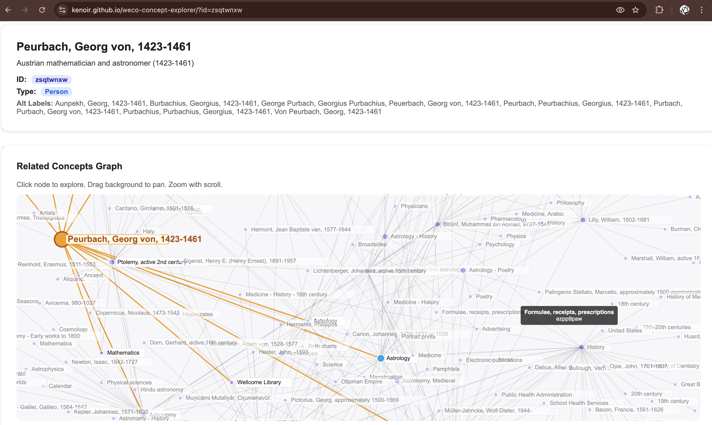

# Wellcome Collection Concept Explorer

An interactive visualization tool for exploring concepts from the Wellcome Collection's digital catalogue. This application allows users to discover relationships between concepts through an interactive D3.js graph and browse related works from the collection.



## Features

- **Interactive Concept Graph**: Navigate through concept relationships using a force-directed graph visualization
- **Dynamic Node Selection**: Click on any concept node to explore its connections and see related concepts
- **Concept Information**: View detailed information about each concept including descriptions, alternative labels, and metadata
- **Related Works**: Browse works from the Wellcome Collection that are associated with the selected concept
- **URL-based Navigation**: Share specific concepts via URL parameters
- **Responsive Design**: Clean, modern interface that works across different screen sizes

## Technology Stack

- **Next.js 15** - React framework with static export for GitHub Pages deployment
- **TypeScript** - Type-safe development
- **D3.js** - Interactive data visualization for the concept graph
- **Wellcome Collection API** - Real-time data fetching from the catalogue
- **Inline React Styles** - No external CSS frameworks, fully self-contained styling

## Live Demo

🌐 **[View the live application](https://kenoir.github.io/weco-concept-explorer/)**

## Local Development

1. **Clone the repository:**
   ```bash
   git clone https://github.com/kenoir/weco-concept-explorer.git
   cd weco-concept-explorer
   ```

2. **Install dependencies:**
   ```bash
   npm install
   ```

3. **Run the development server:**
   ```bash
   npm run dev
   ```
   Open [http://localhost:3000](http://localhost:3000) in your browser.

## Usage

1. The application loads with a default concept displayed
2. Click on any node in the graph to explore that concept
3. The graph shows up to 2 degrees of separation from the current concept
4. View concept details in the information panel
5. Browse related works in the bottom section
6. Use browser navigation or share URLs to return to specific concepts

## Building for Production

To build the application for static export:
```bash
npm run build
```
This generates static files in the `out` directory, ready for deployment to GitHub Pages.

## Deployment

The application is automatically deployed to GitHub Pages using GitHub Actions:
- Every push to the `main` branch triggers the deployment workflow
- The workflow builds the static site and deploys it to the `gh-pages` branch
- Changes are live within minutes of pushing to main

## API Integration

This application integrates with the [Wellcome Collection Catalogue API](https://developers.wellcomecollection.org/catalogue) to fetch:
- Concept definitions and metadata
- Concept relationships (broader/narrower terms)
- Associated works and publications

## Contributing

Contributions are welcome! Please feel free to submit issues, feature requests, or pull requests.

## License

This project is open source and available under the MIT License.